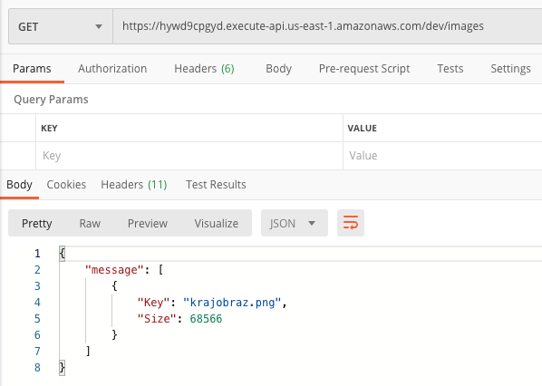
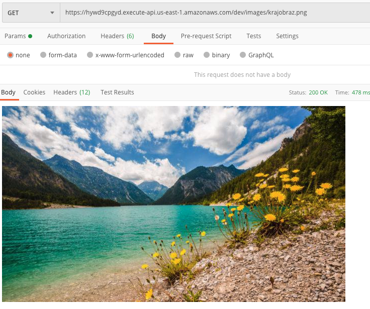
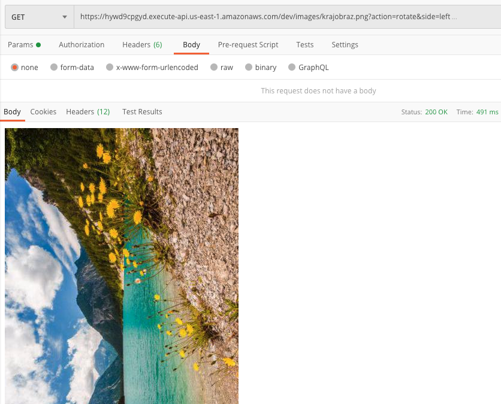
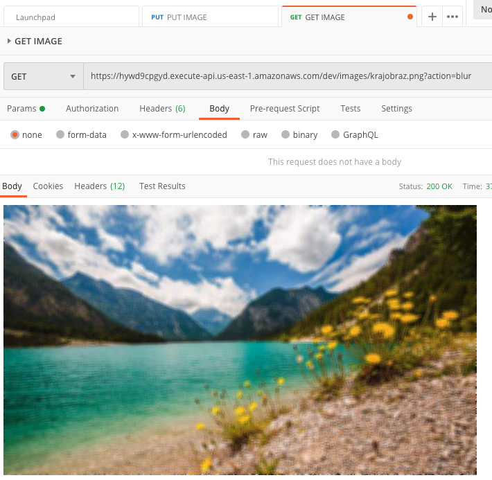
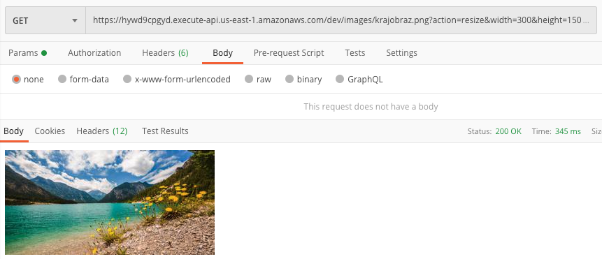
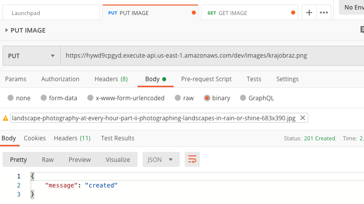
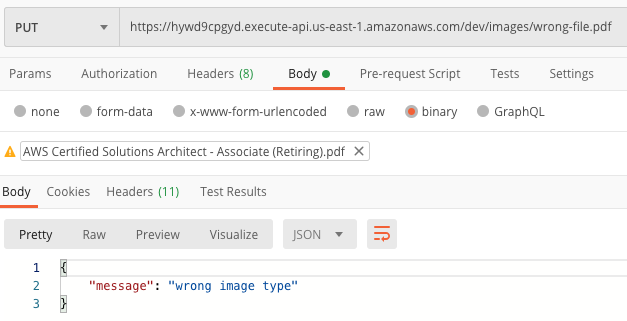
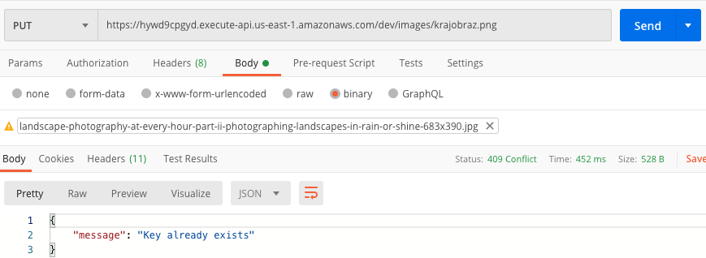
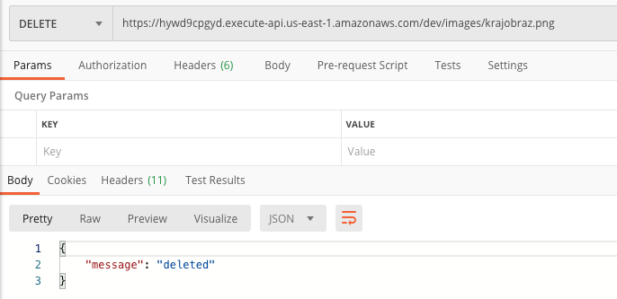
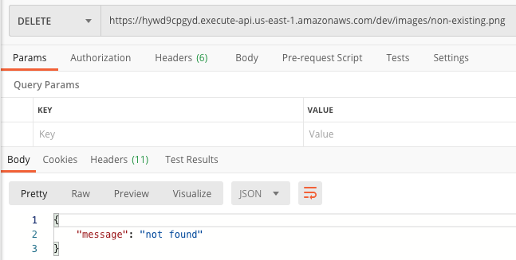

# Serverless images operator

Aplikacja służąca do wykonywania operacji na plikach graficznych (publikowanie/kasowanie/modyfikowanie).

## Wdrażanie

Architektura aplikacji jest oparta na modelu serverless/FaaS, dla którego istnieją różne frameworki umożliwiające sprawne wdrażanie aplikacji na nim opartych.  
Do wdrożenia aplikacji na istniejącym koncie AWS wymagana jest instalacja następujących programów:

- [Serverless framework](https://www.serverless.com/framework/docs/providers/aws/guide/installation/).
  - [Konfiguracja danych uwierzytelniających](https://www.serverless.com/framework/docs/providers/aws/guide/credentials/)
- [Docker Engine](https://docs.docker.com/desktop/) (wymagany na systemach Windows bądź MacOS)

Po instalacji wspomnianych wyżej programów należy doinstalować niezbędne pluginy.  
W pliku [serverless.yml](./serverless.yml) znajduje się sekcja `plugins`. W katalogu projektu, dla każdego wpisu z tej sekcji należy wykonać komendę:

```
npm install --save-dev <nazwa-pluginu>
```

Po wykonaniu powyższych kroków projekt jest gotowy do wdrożenia, co można zrobić następującym poleceniem:

```shell
serverless deploy
```

W celu usunięcia aplikacji należy wykonać polecenie 

```shell
serverless remove
```

## API

Serwis udostępnia następujące operacje na API:

- `GET /images`
- `GET /images/{image}`
- `PUT /images/{image}`
- `DELETE /images/{image}`

### `GET /images`

Operacja wylistowuje wszystkie pliki znajdujące się w Buckecie należącym do aplikacji.

Odpowiedź:

```json
{
    "message": [
        {
            "Key": 'string',
            "Size": 123
        },
    ]
}
```

- message (lista słowników)
  - `Key` (string) - nazwa pliku
  - `Size` (integer) - rozmiar pliku (wyrażony w bajtach)



### `GET /images/{image}`

Operacja wyświetla obrazek o kluczu `{image}`.  
GET dla pojedynczego obrazka umożliwia również modyfikację obrazu w locie.  
Żądaną akcję modyfikacji należy przekazać poprzez query string.



Dostępne akcje:

- `rotate`  
  Rotate umożliwia wyświetlenie obróconego obrazka.
  
  Wymagane dodatkowe parametry:

  - `side` - kierunek obrotu, dozwolone wartości:
    - `left`
    - `right`
    - `top-down`

  Przykład użycia:

  ```
  GET /images/image.png?action=rotate&side=left
  ```

  

- `blur`  
  Blur służy do rozmazywania obrazka.

  Przykład użycia:

  ```
  GET /images/image.png?action=blur
  ```

  

- `resize`  
  Resize umożliwia wyświetlenie obrazka w pożądanym przez użytkownika rozmiarze.

  Wymagane dodatkowe parametry:

  - `width` - szerokość obrazka wyjściowego
  - `height` - wysokość obrazka wyjściowego

  Przykład użycia:

  ```
  GET /images/image.png?action=resize&width=200&height=80
  ```

  

### `PUT /images/{image}`

Operacja służy do umieszczenia przesyłanego zdjęcia pod nazwą `{image}`.

Odpowiedź:

```json
{
    "message": 'string'
}
```

- `message` - słowny opis odpowiedzi towarzyszący kodowi odpowiedzi

Poprawne udostępnienie obrazka sygnalizowane jest kodem odpowiedzi 201 (Created) wraz z odpowiednią wiadomością.



W przypadku próby wysłania nieprawidłowego typu pliku (innego niż obraz) użytkownik otrzyma odpowiedni komunikat towarzyszący kodowi HTTP 400 (Bad Request).



W przypadku, gdy nazwa pliku jest już zajęta, użytkownik otrzyma odpowiedź o kodzie 409 (Conflict) wraz z odpowiednią wiadomością.



### `DELETE /images/{image}`

Operacja służąca do usunięcia udostępnionego wcześniej obrazu o nazwie `{image}`.



W przypadku próby usunięcia nieistniejącego obrazu zwrócona zostanie odpowiedź 404 (Not Found).


