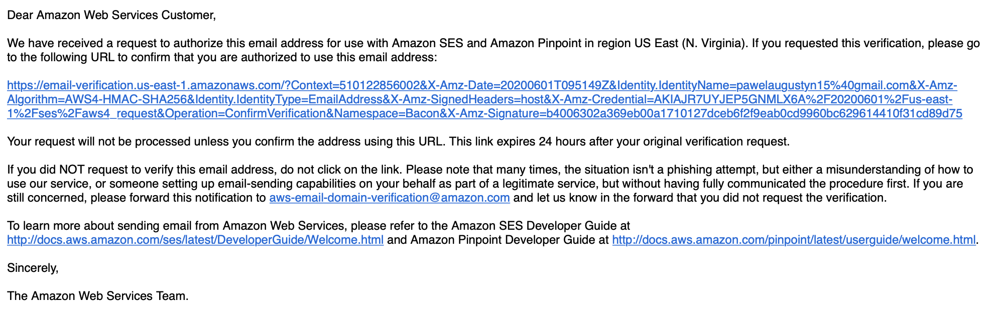
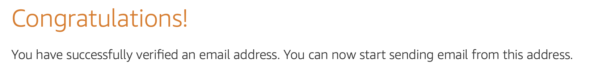
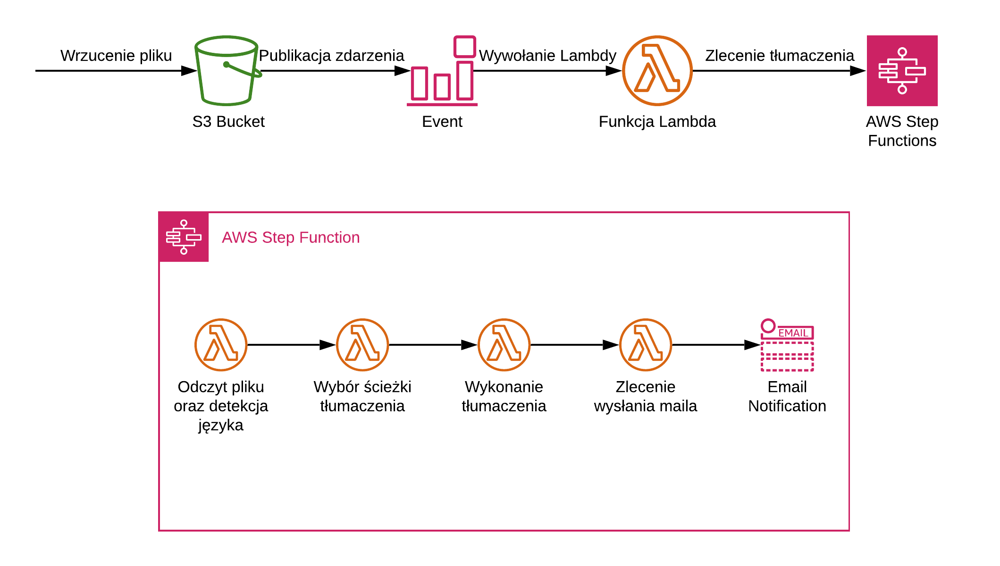
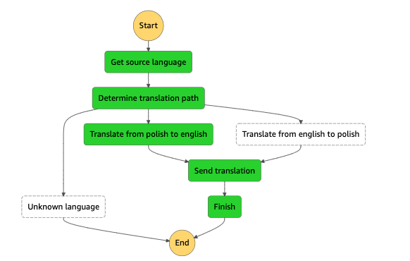
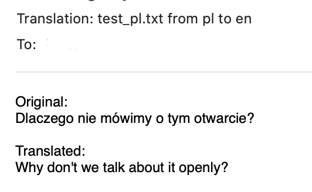

# Serverless translator

Aplikacja służąca do tłumaczenia przesyłanych treści z języka polskiego na angielski

## Wdrażanie

Architektura aplikacji jest oparta na modelu serverless/FaaS, dla którego istnieją różne frameworki umożliwiające sprawne wdrażanie aplikacji na nim opartych.  
Do wdrożenia aplikacji na istniejącym koncie AWS wymagana jest instalacja następujących programów:

- [Serverless framework](https://www.serverless.com/framework/docs/providers/aws/guide/installation/).
  - [Konfiguracja danych uwierzytelniających](https://www.serverless.com/framework/docs/providers/aws/guide/credentials/)
- [Docker Engine](https://docs.docker.com/desktop/) (wymagany na systemach Windows bądź MacOS)

Po instalacji wspomnianych wyżej programów należy doinstalować niezbędne pluginy.  
W pliku [serverless.yml](./serverless.yml) znajduje się sekcja `plugins`. W katalogu projektu, dla każdego wpisu z tej sekcji należy wykonać komendę:

```
npm install --save-dev <nazwa-pluginu>
```

Po wykonaniu powyższych kroków projekt jest gotowy do wdrożenia, co można zrobić następującym poleceniem:

```shell
serverless deploy --email <ADRES_EMAIL>
```

- `<ADRES_EMAIL>` - adres, na który przychodzić będą tłumaczenia tekstów

W wyniku poprawnie przeprowadzonego dpeloymentu aplikacji użytkownik otrzyma następującą wiadomość email



Po kliknięciu odnośnika znajdującego się w wiadomości własność adresu email zostanie potwierdzona, co zostanie pokazane następującym komunikatem



W celu usunięcia aplikacji należy wykonać polecenie 

```shell
serverless remove
```

## Architektura



Aplikacja została zbudowana w architekturze Serverless przy użyciu następujących serwisów:

- AWS Lambda - serwis udostępniający uruchamianie kodu w systemie FaaS
- AWS S3 - serwis służący do przechowywania plików
- AWS SQS - kolejka służąca do przekazywania zdarzeń
- Step Functions - serwis umożliwiający orkiestrację funkcji Lambda  
  
- AWS SES - serwis dostarczający mechanizm wysyłania wiadomości email
- Amazon Comprehend - serwis dostarczający mechanizm przetwarzania języka naturalnego (Natural Language Processing, w skrócie NLP), wykorzystywany do wykrywania dominującego języka
- Amazon Translate - serwis dostarczający mechanizm tłumaczenia tekstów

## Użycie

Aplikacja służy do tłumaczenia tekstów z języka polski na angielski (lub odwrotnie).  
Celem zlecenia tłumaczenia, przy użyciu konsoli AWS S3 należy umieścić plik w buckecie `aws-python-translations`.  
Zdarzenie to powoduje wysłanie wiadomości do kolejki AWS SQS, która jest konsumowana przez funkcję AWS Lambda odpowiadającą za inicjację procesu tłumaczenia.

Aplikacja wspiera dwa tryby detekcji języka:

- *automatyczny* - aplikacja na podstawie treści znajdujących się w pliku sprawdza, który z języków jest językiem dominującym we wprowadzonym tekście; jeśli wykryty zostanie inny język niż angielski/polski, proces zostaje przerwany
- *manualny* - na podstawie nazwy pliku; udostępniając plik o przykładowej nazwie `nazwa.txt` możemy wskazać, że znajdujące się w nim treści są napisane w danym języku (polski lub angielski) poprzez dodanie odpowiedniego _suffixu_ (`nazwa_pl.txt` dla polskiego lub `nazwa_en.txt` dla angielskiego)

Po wykryciu języka źródłowego aplikacja dokonuje tłumaczenia tekstu na drugi język.  

Wynik tłumaczenia oraz tekst źródłowy są następnie przesyłane w wiadomości mailowej na wskazany podczas procedury instalacji adres.


